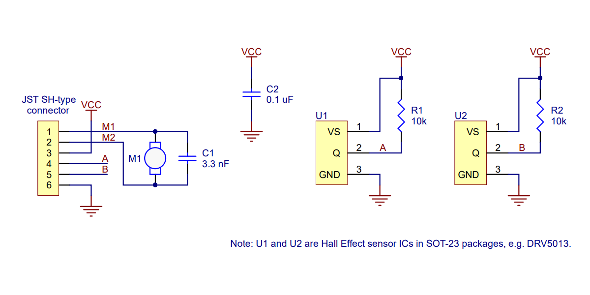
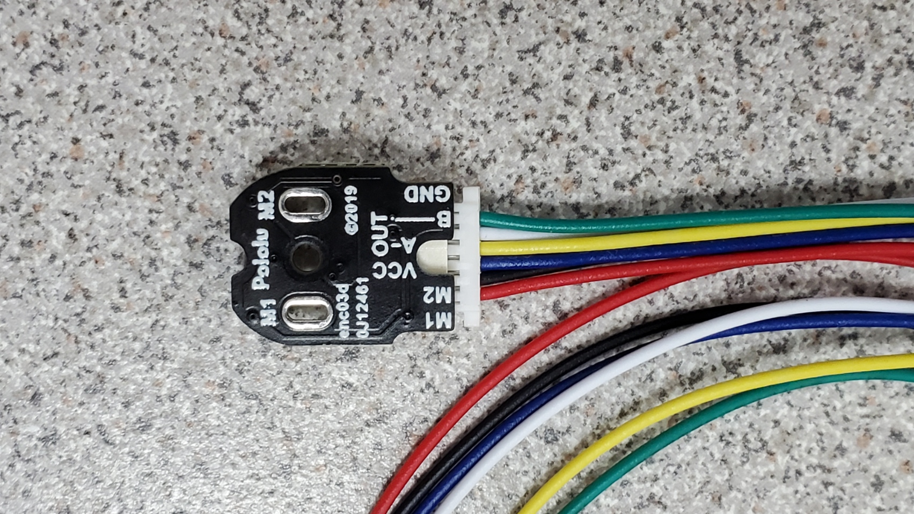
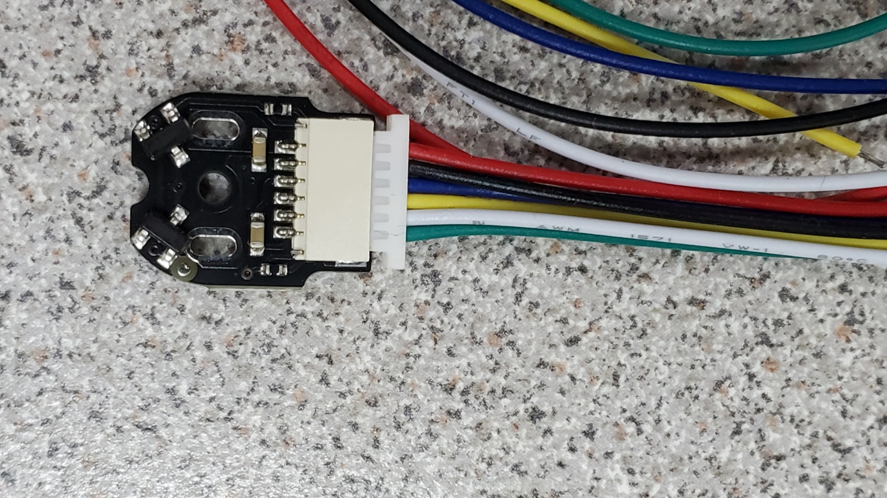
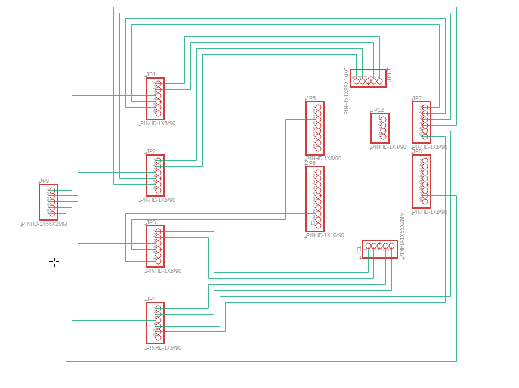

Code for the V2 Wemos D1 R32 that controls the 4 motors of the prosthesis.
It receives commands from PC central via Serial or Bluetooth.

# Important notes
* It assumes the prosthesis is in the initial position when it is turned on. In the case it is not is required to be reset.

# Software
* Based on the **MotorControlShield**. 
* Based on the **ESP32Encoder**. 

[WARNING] changes were required in the original library. 
Download to lib folder.
https://github.com/ztjona/MotorControlShield
https://github.com/ztjona/ESP32Encoder

* Be sure to correctly install the driver for Wemos D1 R32. 

In Windows 11, altough it is recognized and installed a *CH340* driver, at march 2024, it does need to be reinstalled.

https://learn.sparkfun.com/tutorials/how-to-install-ch340-drivers/all#drivers-if-you-need-them

# Hardware
* V2: **V2 Wemos D1 R32**
* V1¨: Arduino UNO

## Adafruit Motor Shield V1
Driver with 4 DC motors. Old version. 

### Modifications
To work with the R32 it has the following modifications:

1. Extend pin 13 of the board. In this pin must be connected the first encoder signal.
1. Extend pin 2 of the board (or solder a male pin in its parallel pin). In this pin must be connected the second encoder signal.
1. Extend pin 3.3v of the board. This pin must be connected to the encoders Vcc. 
    * It also is required a pin bar of 5 channels shortcircuited to the 3.3v pin.
1. solder male pins in the corresponding spaces for A0-A5.
1. solder male pins in the corresponding spaces for GNDs.

## Wemos D1 R32
It has the shape of the Arduino UNO with a ESP32 instead.

### Modifications
Sadly, it requires some modifications to work:
* Desolder the pull-down resistors of the GPIO2.
* Desolder the built in led of the GPIO2.
These changes are required so that the encoder. 

#### Before

#### After

### Notes
 * When debugging in serial, Line endings must be set to new line "NL" or "LF".
 * The Wemos D1 R32 board used has a wrong silk. One pin was mislabeled. Be aware.
* If board can not be bootloaded and the shield is connected, disconnect only motor index and try again.
* If after removing index motor bootloading still fails, try removing all the other motor connectors.
* The paulstoffregen/Encoder library does not work in ESP32. it was changed to madhephaestus/ESP32Encoder. 

# Encoder info
Device:
https://www.pololu.com/product/4761

The pinout is shown in the image. Where:

* **M1** is motor positive pin
* **M2** is motor negative pin
* **Vcc** is Vcc
* **A** is encoder signal
* **B** is encoder signal
* **GND** is ground truth

The encoder board senses the rotation of the magnetic disc and provides a resolution of 12 counts per revolution.
It has dual-channel Hall effect sensor boards and two 6-pole magnetic discs.

# Media

# Schematic

# Changelog
* v2.6: 19 / 12 / 2023    -   Opening and closing, and inerrupt limits.
* v2.5: 03 / 07 / 2023    -   Added bluetooth | Slow and matlab not connect.

* v2: 30 / 05 / 2023. V2 that uses the Wemos D1 R32.

* v1: 23 / 06 / 2021

